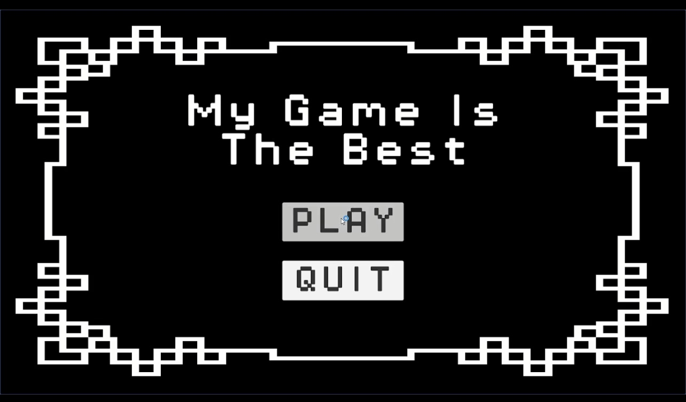
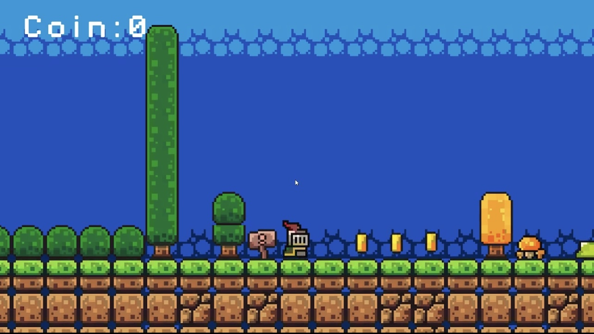
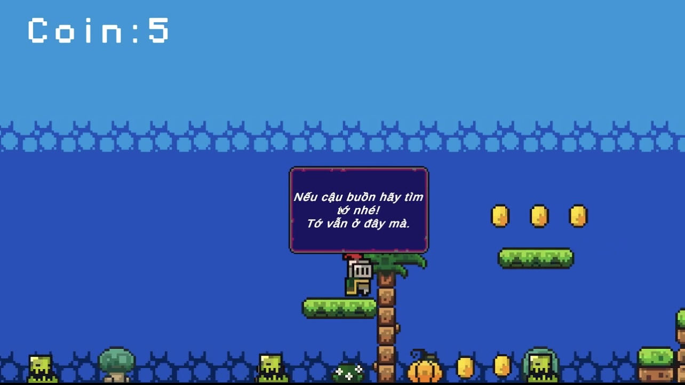
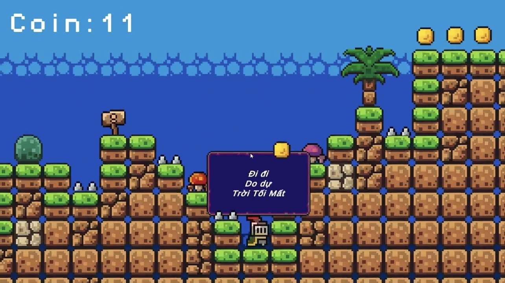
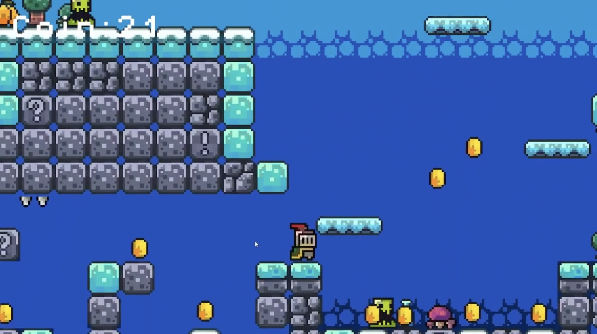

# MakeByMe2D
2D Eentertainment Game
 
Mô tả
 - Game giải trí 2D phưu lưu mạo hiểm vượt qua thử thách.
 - Game được thiết kế và xử lý thông qua Unity.
 - Người chơi sẽ di chuyển nhân vật sang trái sang phải bằng các phím A và D trên bàn phím máy tính, space để nhảy.
 - Di chuyển tránh né kẻ định, bẫy trên đường đi.
 - Nhặt vàng để có thể ghi điểm và tìm kiếm chìa khóa để qua màn tiếp theo.
   
Một số hình ảnh trong Game.
<table>
  <tr>
    <td></td>
    <td></td>
  </tr>
  <tr>
    <td></td>
    <td></td>
  </tr>
  <tr>
    <td></td>
    <td></td>
  </tr>
</table>

